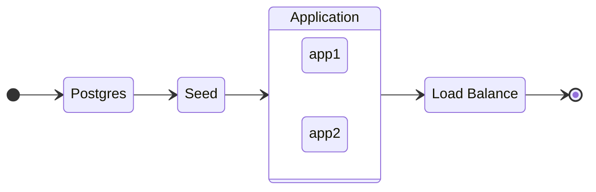

# Generate and stream CSV files with Express

This is a test project, using node streams to deliver on demand csv files to clients.

The used packages:

1. [`express`](https://expressjs.com/) as http server
2. [`@faker-js/faker`](https://fakerjs.dev/) to generate fake data
3. [`csv-stringify`](https://csv.js.org/stringify/) to convert object in csv

It also uses [`Readable.from`](https://nodejs.org/api/stream.html#streamreadablefromiterable-options) to create a `Readable Streams` from a [`generator`](https://developer.mozilla.org/en-US/docs/Web/JavaScript/Reference/Global_Objects/Generator) and [`AbortController`](https://developer.mozilla.org/en-US/docs/Web/API/AbortController) to stop the download if the client cancel the request.

## Running

This project uses `docker compose`:

```sh
docker compose up -d
```

or

```sh
npm run docker:up
```

The startup sequence is:



To destroy the services, including volumes and images:

```sh
docker compose down --volumes --rmi all
```

or

```sh
npm run docker:down
```

## Testing

### In the browser

The **url** `http://localhost/download-csv` will download a 10.000 line csv file. But this `endpoint` has two `query params`:

1. `size` is the number of lines

> Examples
> `http://localhost/download-csv/?size=50000` will download a csv with 50k lines.

### With `curl`

The `url` and `query params` are the same.

```sh
# this command to see the lines building up
curl http://localhost/download-csv?size=500
```

```sh
# this command to download the file, and see the progress
curl http://localhost/download-csv?size=500 -o ./file.csv
```

### Concurrency

Because it uses `Node Streams` and `asynchronous` delay (it's simulates requests) this example can handle a lot of requests at once without `blocking` or getting `out of memory`
